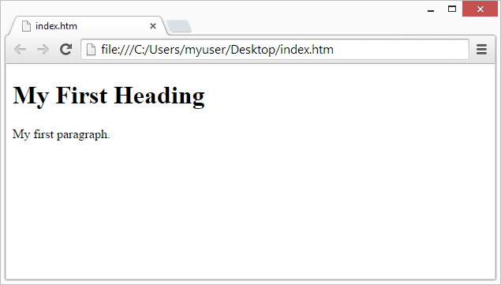

# ¿Qué es un elemento en HTML5?
Un elemento en __HTML__ se define mediante una etiqueta de inicio, algo de contenido y una etiqueta de cierre:

~~~
<nombre nombre de la etiqueta > El conenido va aquí </nombre de la etiqueta> 
~~~

__El elemento  HTML__ es todo, desde la etiqueta inicial hasta la etiqueta de cierre:

~~~
<h1> Mi primer título </h1>

 Mi primer párrafo. 

~~~

_Nota:_ Algunos de los elementos en __HTML__  no tienen contenido (como el elemento ` `). estos elementos se llaman elementos vacíos. ¡Los elemetos vacíos no tienen etiqueta final!

***
# Navegadores Web 
El objetivo de un navegador web (Chrome, Edge, Firefox, Safari) es leer docuemtos __HTML__ y mostralos correctamente. 

Un navegador no muestra las etiqueta __HTML__, pero las utiliza para determinar cómo mostrar el documento:

